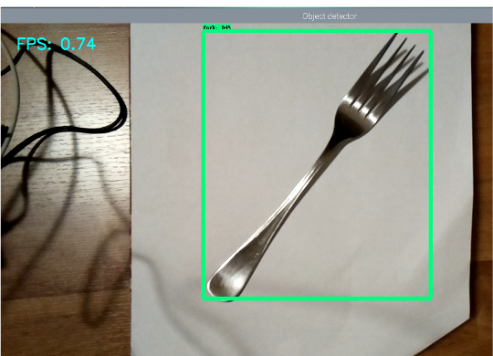
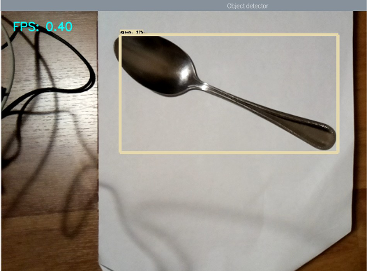

# Cutlery Sorting Machine with Object Detection on Raspberry Pi

**A group project to design and prototype a cutlery sorting machine using a pre-trained object detection model and Raspberry Pi for classification and sorting, with UV sanitization as a conceptual feature.**

This repository focuses on the technical implementation of the object detection and sorting mechanism, led by me as the **Project Leader and Technical Lead**.

---



---

## Table of Contents
1. [Project Objective](#project-objective)
2. [Key Features](#key-features)
3. [Technical Implementation](#technical-implementation)
   - [Object Detection](#object-detection)
   - [Workflow](#workflow)
   - [Hardware Components](#hardware-components)
   - [Software Tools](#software-tools)
4. [Results](#results)
5. [Prototype Demo](#prototype-demo)
6. [Credits and References](#credits-and-references)

---

## Project Objective

This project showcases the use of object detection technology for automated cutlery sorting. 
The machine:
- Classifies cutlery (forks and spoons) using a pre-trained TensorFlow model.
- Sorts items into designated bins with servo motor automation.

For more details about the overall project, please see the [Project Overview](docs/project_overview.pdf) file in the `docs` folder.


---

## Key Features

- **Object Detection**: Real-time classification of forks and spoons with 90%+ accuracy.
- **Automation**: Servo motors sort cutlery into the correct bins.
- **Hardware Integration**: Built using Raspberry Pi Model 4B, Camera Module V2, and SG-5010 servo motors.

---

## Technical Implementation

### Object Detection
- **Model**: TensorFlow `ssdlite_mobilenet_v2_coco`.
- **Functionality**: Classifies cutlery with high precision for sorting.

### Workflow
1. **Image Capture**: Raspberry Pi Camera captures real-time images of cutlery.
2. **Detection**: TensorFlow model classifies items as forks or spoons.
3. **Sorting**: Servo motors move the cutlery into the appropriate bins based on classification.

### Hardware Components
- **Raspberry Pi Model 4B (4GB RAM)**: Runs the object detection model and controls hardware components.
- **Raspberry Pi Camera Module V2**: Captures images for object detection.
- **Servo Motor SG-5010**: Automates the sorting process.

### Software Tools
- **TensorFlow Object Detection API**
- **Python Libraries**: TensorFlow, OpenCV, RPi.GPIO

---

## Results

The prototype achieved a detection confidence of **90%+** for forks and spoons under various test conditions.

### Examples
- **Fork Detection**:
  
- **Spoon Detection**:
  

### Servo Logs
```plaintext
class_name=fork, scores=0.928337574005127
Turning servo left
```

## Prototype Demo


---


## Credits and References

This project builds upon the TensorFlow object detection tutorial for Raspberry Pi by Edje Electronics. Significant modifications were made to adapt the project for a custom use case (cutlery sorting with servo motors).

### Original Repository
- **Author**: Evan Juras
- **Repository**: [TensorFlow Object Detection on the Raspberry Pi](https://github.com/EdjeElectronics/TensorFlow-Object-Detection-on-the-Raspberry-Pi)
- **Purpose**: Demonstrates object detection on Raspberry Pi using TensorFlow.

### Key Modifications
1. **Hardware Integration**: Added servo motor control for sorting detected objects (forks and spoons) into separate compartments.
2. **Threshold Adjustments**: Tuned classification thresholds for improved accuracy in a constrained environment.
3. **Custom Logging**: Implemented logs to monitor object detection results and corresponding hardware actions.
4. **Application-Specific Adaptation**: Focused the object detection model on a specific use case (cutlery sorting and UV sanitization).

Acknowledgments to the original author and contributors for their excellent tutorial and codebase, which served as the foundation for this project.
